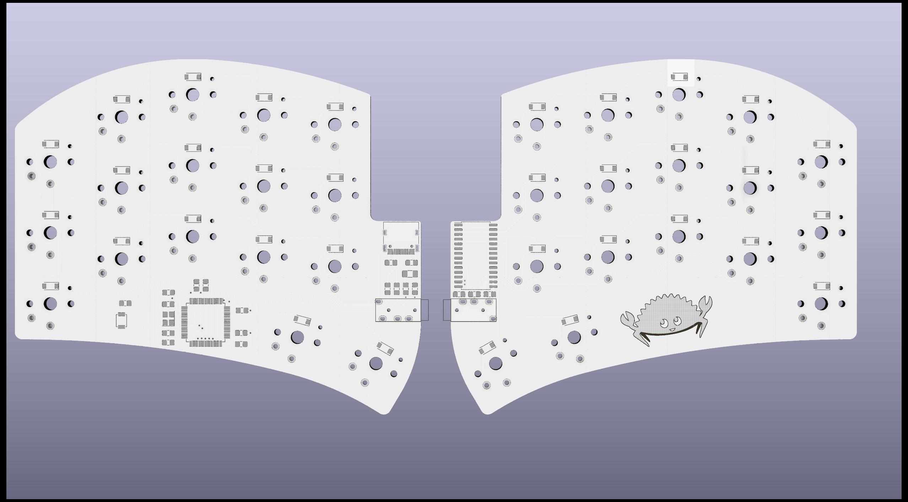
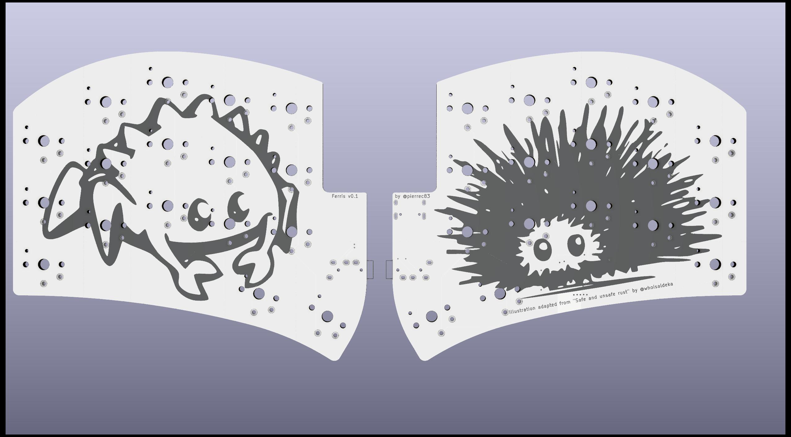

Meet Ferris, a minimalistic keyboard
====================================

Named after the Rustlang mascott, ferris is a 34 keys split keyboard that tries to be about as cute as its namesake.

Ferris is minimalistic: it aims to be a functional, ergonomic keyboard that is pleasing to use as a daily driver. It only supports choc keyswitches, although it would be easy to make a MX version if there was interest.

Goals:
------
* Comfort
* Aesthetics
* Portability
* Ease of assembly
* Low-Cost
* Low-Profile
* 34 keys
* Hackable
* USB-C
* No compromise

Non-Goals:
----------
* Reversible PCB used for both hands
* Pro-micro/Elite C/Proton C support
* Hot-Swap support
* Multi-switches support
* Support for any feature (RGB, OLED, encoders, ...) that is not of interest to the user

Philosophy:
-----------
Most boards provide many features that the Ferris does not provide. The most basic example would be MX switch support. MX switches are the Lingua Franca of switches and footprints supporting both MX and choc switches are readily available. It almost seems silly not to provide MX compatibility for those users who may desire it.
This specific example illustrates a philosophical difference between the Ferris and most other boards: the Ferris is built around the "Keep It Simple, Stupid" philosophy present in Arch Linux and other software projects. If the user doesn't need a feature, do not offer it and the trade-offs that go with it. The user knows better. If they want that feature, they can add it themselves. There is nothing wrong with MX switches, but when supporting both MX and chocs, a couple of things happen: The board contains unnecessary holes, which compromises on the aesthetics goal. The choc or the MX switches end up upside down, which again compromises with the aesthetics.

By following these guiding principles, we end up with a clean design that could be modified as needed to adapt any other set of user requirements.

Comfort:
--------
On the Ferris, the keys are layed out in the same way as on the [Kyria](https://splitkb.com/products/kyria-pcb-kit), with the outer column, the two inner, the outer and the two upper thumb keys removed. I have found this layout to be extremely pleasant to daily drive and plan to use the ferris as a companion to the Kyria, which means that sharing the keys layout will help my fingers feel at home on the Ferris.
While exploring my taste on the Kyria, I also discovered I found light linear switches to be very comfortable for me. I plan to bring this to the next level by exploring the lighter Kailh choc linear switches on this board. These can be quite a bit lighter than the gateron clears that I daily drive. I am expecting for this to result in improved ergonomics.
Given the relatively high profile of my Kyria board with its case, I sculpted a pair of wrist rests to go with it which allows me to type comfortably on it. By making the Ferris low profile, I am hoping to get a similar amount of comfort without a need for wrist rests.
Limiting the number of keys to only 34 means that all fingers can spend most of their time in their home position and only occasionally move one unit away. The pinkies need never be stretched and it is easy to find the thumbs home position as it's one out of only two options. This does assume the use of layers in the firmware to get fully fledged functionality in this form factor.

Aesthetics:
-----------
To match its minimalistic design philosophy, the Ferris adopts a minimalistic and yet interesting look.
The lines are few and clean. The traces are carefully routed with the intent to highlight the switch matrix (rows on the front, columns on the back). It's a design that doesn't hide "how the sausage is made", but that remains unobtrusive thanks to a limited number of features supported.
All the components are top-mounted for eye candy and a ferris the crab logo decorates the right hand board.
The SOD-123 diodes are tiny and live under switches in the spot that is usually reserved for the per-key backlights. This means that they are not visible once assembled.
The back is really bare, without any components or text. Only a few traces and the solder joints for the switches, TRRS jacks and the USB C connector should show. The intention is to only add a few fabric pads on the bottom side to be used as feet and protect the desk's surface from solder joints.

Portability:
------------
With only 34 keys, and without the added footprint of one or even two pro-micros, the Ferris is tiny and easy to pack and use on the go. It is also intended to be used without a case or wristrests, which makes the entire package able to fit in an 11x10x2 cm footprint while carrying it.

Ease of assembly:
-----------------
Most components are smd mounted, which means that they can be SMT assembled when getting the PCBs printed. All that remains is to solder in the switches, the jack and USB-C connectors.
Since the only holes present are exactly the ones needed, there is only one way where the hand-soldered components fit, so it shouldn't be possible to mount them the wrong way by mistake.
If hand-soldering the smd components, one must refer to the schematics for identifying where the resistors and capacitors go as the board is unlabelled for aesthetical reasons.

Low-Cost:
---------
With a reduced number of special features such as backlighting, OLEDs etc., costs are saved in all dimensions. By only requiring one atmega32u4 and one mcp23017, the electronic components are also very affordable, especially when comparing to an elite-C board which would be needed to get USB-C support if we had gone the route of a pro-micro compatible controller or two.
It should be possible to get 5 Ferris keyboards printed with all the components (mostly basic parts from LCSC. See the bill of materials) for well under 100$ with shipping to Europe by using the services of a PCB shop such as JLCPCB. Fancier options such as gold plated pads, nicer mask colors etc. may drive the cost up a little bit but larger orders would also drive it down.
Thanks to the small number of keys, switches and keycaps costs can also be kept quite low. Depending on specific choices, it should be possible to fully fit a board for around 50-60$ with shipping to Europe.
These low-costs make it feasible to customize the design to one's liking (for instance, adding support for hot swap socket) and run a limited run for one to a handful of interested users.

Low-Profile:
------------
All the components are top-mounted and low profile. The highest point on the keyboard should be at the tip of the Kailh choc switches, which sticks 6mm above the pcb, plus the added height of the chosen keycaps.
There are only solder joints on the bottom, so even with pads to protect the surface on which the keyboard rests, the entire board should be under 1cm thick.

34 keys:
--------
I have been using a gherkin with only thirty keys as a secondary keyboard for a few weeks. In fact, I am typing on one right now. With a well thought out keymap making heavy use of homerow modifiers, the 30 keys on the gherkin are just about enough. There are some infortunate trade-offs, though, such as swapping a letter with the space key to allow for an easy to reach space key. Soon after I had the Kyria, I stopped using the two outer columns as the ergonomic trade-off in reaching for them was not worth avoiding one modifier. That means I was using 36 keys, which is the number I was originally aiming to keep on the Ferris. On further reflection, though, and after modifying my keymap to use some lessons from the gherkin, I am confident I can be totally comfortable without using the outer thumb keys. In fact, it can avoid accidental unhoming of the thumbs, which is a nice benefit. Benefits of this decision include a more compact overall footprint of the keyboard, a lower cost and a more interesting design for my taste (the outer profile is only composed of 3 straight lines and 3 curved lines).

Hackable:
---------
As is customary in the custom mechanical space, the keyboard's firmware can be fully customized using [QMK](https://github.com/qmk/qmk_firmware).
In addition to this, the hardware is licensed with the Solderpad license, version 2.1 which is a permissive license similar to Apache, but taylored to hardware projects.

The idea of limiting a single board to exactly one set of features goes hand in hand with the idea of creating a number of modifications of the original design to suit all tastes without ever compromising by overloading any single design.

Here are some ideas for modifications on the original design, and cute names to go with them:
* Ferris lit: Ferris with per key rgb backlight
* Ferris swap: Ferris with support for Kailh hotswap sockets
* Ferris wheel: Ferris with an encoder
* Ferris tent: Ferris with some M3 screw mounts on the side to allow tenting with Ergodox legs or equivalent
* Ferris mono: A non-split version where both sides would be connected by pcb like an Atreus
* Ferris air: Ferris with bluetooth

These are just a few ideas. The sky is the limit. Contributions welcome. I'm also happy to help to bring interesting concepts to life if there is interest.

USB-C:
------
It's 2020, people! Why is micro-usb still the defacto standard in hobbyist keyboard? Why is there such a premium for USB-C support on something like an elite-C compared to a pro-micro? USB-C all the things and let's forget about these ancient cables sooner rather than later.

No compromise:
--------------
No compromise doesn't mean: let's put all the features on one board. There are boards like this and they are great as a playground and to discover features one likes. No compromise here means: let's build the right board for a specific user profile with exactly the right set of features and nothing more. No trade-off or compromise will be needed for flexibility because flexibility can be obtained by enabling the user to create their own modification to fit their taste.

Work In Progress:
-----------------
More documentation is coming to showcase the technical aspects of the design.

This is the first board I ever designed and I haven't printed it and confirmed everything works yet, so use at your own risk until I test it.
